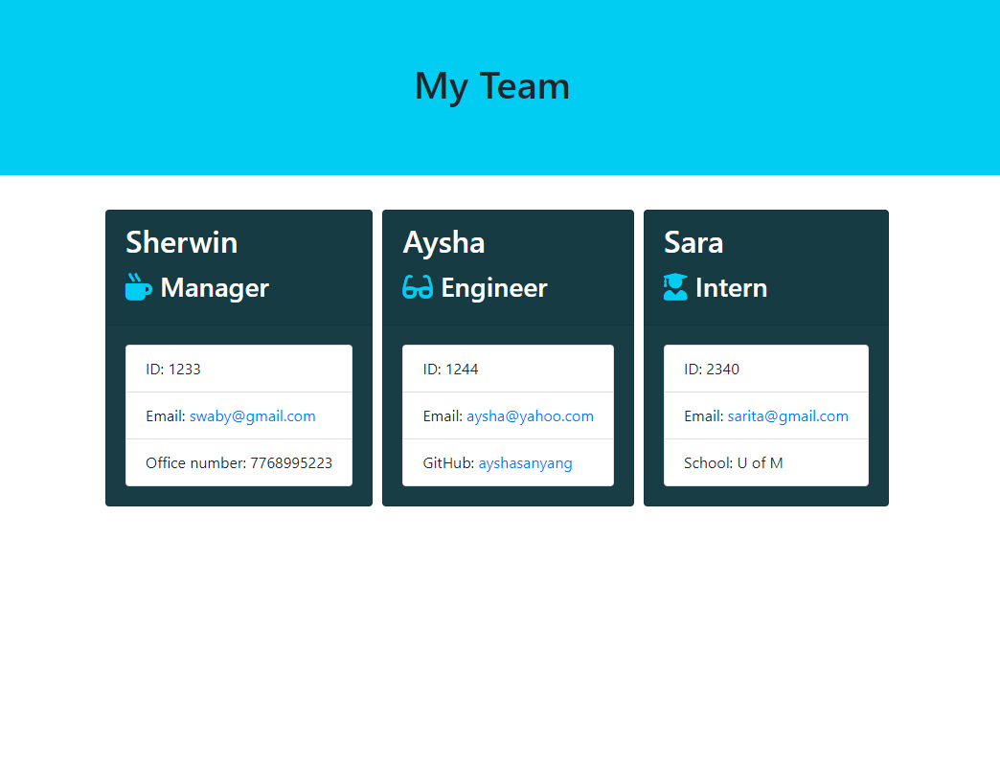

# Team-Profile-Generator

## Description 
This is a Node CLI that takes employees information and generates a HTML file.
## User input
The project must prompt the user to build an engineering team. An engineering
team consists of a manager, and any number of engineers and interns.
___
## License

## Test
To test the application, cd to the test directory. Type this command, npm run test. Then it shows a series of test results, green indicates the number of test passes and red indicates the number of the test fails.

## Technologies
Team profile generator was build using:

- HTML
- CSS
- Bootstrap
- JavaScript
- Node.js