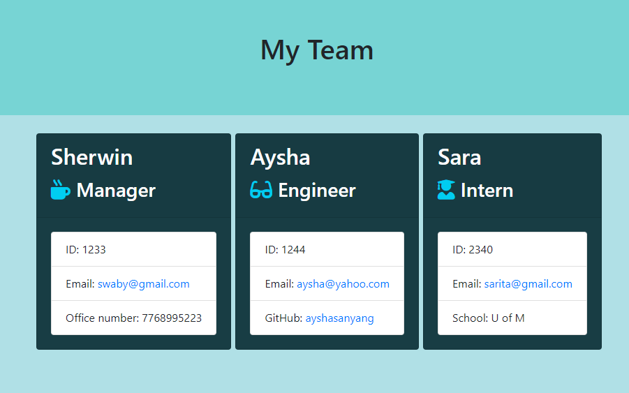

# Team-Profile-Generator

## Description 
This is a Node CLI that takes employees information and generates a HTML file.
## User input
The project must prompt the user to build an engineering team. An engineering
team consists of a manager, and any number of engineers and interns.
___
## License

## Usage
1. Open your terminal, run the command node app.js.

1. When prompted, enter the manager's information.

1. Add additional team members role from the list.

1. When all the team members have been added,
 the app automatically generates a team.html file into the output folder.

## Test
To test the application, cd to the test directory. Type this command, npm run test. Then it shows a series of test results, green indicates the number of test passes and red indicates the number of the test fails.

## Technologies
Team profile generator was build using:

- HTML
- CSS
- Bootstrap
- JavaScript
- Node.js